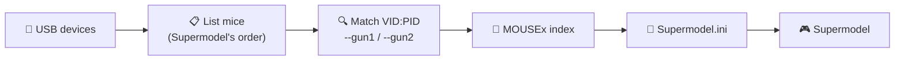

<div align="center">

```
  ______ _____    ____  __ __  ____
 /  ___//     \  / ___\|  |  \/    \
 \___ \|  Y Y  \/ /_/  >  |  /   |  \
/____  >__|_|  /\___  /|____/|___|  /
     \/      \//_____/            \/
```

### 🎯 Plug in your lightguns. Run one command. Play.

**smgun** assigns your USB lightguns to Player 1 and Player 2 in the
[Supermodel](https://www.supermodel3.com/) Sega Model 3 emulator automatically,
so you never have to work out `MOUSE1` and `MOUSE2` by hand again.

[](https://github.com/tbreckle/smgun/actions/workflows/ci.yml)
[](https://github.com/tbreckle/smgun/releases)
[](LICENSE)


[**Download**](https://github.com/tbreckle/smgun/releases) ·
[Quick Start](#-quick-start) ·
[How It Works](#%EF%B8%8F-how-it-works) ·
[Usage](#-usage) ·
[FAQ](#-faq) ·
[Development](DEV.md)

</div>

---

## 🤔 The Problem

Supermodel numbers mice as `MOUSE1`, `MOUSE2`, … in the order the operating system reports them.
That order changes when you plug devices into different ports, add a new mouse or just reboot.
One day Player 1's gun controls Player 2's crosshair, and you're back to editing
`Supermodel.ini` by hand.

## ✨ The Fix

Tell smgun your guns' **USB VID:PID** once. Every time you run it, it finds the guns, works out
which `MOUSEx` numbers Supermodel will give them, and writes those into your INI file.

```console
$ smgun --gun1 046D:C05A --gun2 046D:C05B
[INFO  smgun] Found 3 device(s):
[INFO  smgun]   Mouse 1: USB Optical Mouse (VID:046D PID:C077)
[INFO  smgun]   Mouse 2: Lightgun A (VID:046D PID:C05A)
[INFO  smgun]   Mouse 3: Lightgun B (VID:046D PID:C05B)
[INFO  smgun]
[INFO  smgun] Player 1: Device 2 (VID:046D PID:C05A)
[INFO  smgun] Player 2: Device 3 (VID:046D PID:C05B)
[INFO  smgun]
[INFO  smgun] Successfully updated Supermodel configuration: Config/Supermodel.ini
```

## 🚀 Features

| | |
|---|---|
| 🔍 **VID:PID matching** | Finds your guns by USB vendor and product ID, whatever port they're in |
| 🪟 **Matches Supermodel on Windows** | Lists mice through Raw Input in the same order as Supermodel, so the `MOUSEx` numbers are right |
| 👯 **Identical guns work** | Two guns with the same VID:PID are assigned in device order, and the same device is never given to both players |
| 📝 **Leaves your INI alone** | Only the gun settings change; comments, layout and all other settings stay as they are |
| 🎮 **Digital and analog guns** | `--use-analog` writes the analog gun settings used by Ocean Hunter and L.A. Machineguns |
| 🧩 **Per-game sections too** | Gun settings in game sections are updated as well, so they can't override the new values |
| 🔓 **No admin rights** | Runs as a normal user on Windows and Linux |
| ⚡ **One small binary** | No runtime, no installer, just a single executable |

## ⚡ Quick Start

**1. Download** the archive for your platform from the
[latest release](https://github.com/tbreckle/smgun/releases/latest) and extract it into your
Supermodel folder.

**2. Find your guns' VID:PID:**

```bash
smgun --list
```

**3. Configure Supermodel:**

```bash
smgun --gun1 046D:C05A --gun2 046D:C05B
```

That's it. Start Supermodel and shoot. 🔫

> [!IMPORTANT]
> On Windows, Supermodel has to use Raw Input to tell several mice apart. Set it in your INI file
> or start Supermodel with `-input-system=rawinput`:
> ```ini
> InputSystem = "rawinput"
> ```

## ⚙️ How It Works



smgun writes these settings for **Player 1**:

```ini
InputGunX      = "MOUSE1_XAXIS"         ; horizontal aim
InputGunY      = "MOUSE1_YAXIS"         ; vertical aim
InputTrigger   = "MOUSE1_LEFT_BUTTON"   ; trigger
InputOffscreen = "MOUSE1_RIGHT_BUTTON"  ; point off-screen (reload)
```

**Player 2** gets the same settings with a `2` suffix (`InputGunX2`, `InputTrigger2`, …), and
with `--use-analog` smgun writes `InputAnalogGunX`, `InputAnalogGunY`, `InputAnalogTriggerLeft`
and `InputAnalogTriggerRight` instead.

Settings are updated wherever they appear. Settings missing from `[ Global ]` are added there.

## 📖 Usage

```text
smgun [OPTIONS] --gun1 <VID:PID>
smgun --list
```

| Option | Description |
|---|---|
| `-l`, `--list` | List all mice with their index and VID:PID, then exit |
| `-1`, `--gun1 <VID:PID>` | Player 1's lightgun, e.g. `046D:C05A` (required unless `--list`) |
| `-2`, `--gun2 <VID:PID>` | Player 2's lightgun (optional) |
| `-i`, `--ini <FILE>` | Supermodel INI file to update (default: `Config/Supermodel.ini`) |
| `--use-analog` | Write the analog gun settings instead of the digital ones |
| `-h`, `--help` | Show help |

Set `RUST_LOG=debug` for detailed logging.

### 🕹️ Run it from your frontend

smgun exits with a non-zero status when a gun is missing, so you can put it in front of
Supermodel in a launcher script (LaunchBox, RetroBat, a desktop shortcut, …):

```bat
@echo off
cd /d "%~dp0"
smgun.exe --gun1 046D:C05A --gun2 046D:C05B || (pause & exit /b 1)
Supermodel.exe %*
```

Every launch picks up the current device order, even after replugging or a reboot.

## 💻 Platforms

| Platform | Status | Mouse order from |
|---|---|---|
| 🪟 **Windows** | ✅ Main target, pre-built | Raw Input, in the same order as Supermodel |
| 🐧 **Linux** | ✅ Pre-built | libusb, sorted by bus; names from sysfs |
| 🍎 **macOS** | 🛠️ Build from source | libusb |

Every mouse counts towards the index on Windows, including touchpads and other non-USB pointing
devices (shown as `VID:0000 PID:0000`).

## 📦 Installation

### Pre-built binaries

Get them from [GitHub Releases](https://github.com/tbreckle/smgun/releases):

| File | Contents |
|---|---|
| `smgun-<version>-windows-x86_64.zip` | `smgun.exe`, README, LICENSE |
| `smgun-<version>-linux-x86_64.tar.gz` | `smgun`, README, LICENSE |
| `SHA256SUMS` | Checksums of the archives |

Want the latest development build? Every [CI run](https://github.com/tbreckle/smgun/actions/workflows/ci.yml)
attaches unofficial builds (`0.0.0+<commit>`) as artifacts.

### From source

```bash
git clone https://github.com/tbreckle/smgun.git
cd smgun
cargo build --release   # Linux needs libusb-1.0-0-dev and pkg-config
```

See the [Development Guide](DEV.md) for details.

## ❓ FAQ

<details>
<summary><b>How do I find my gun's VID:PID?</b></summary>

Run `smgun --list` with the gun plugged in. Unplug it and run the command again if you're not
sure which entry it is: the one that disappeared is your gun.
</details>

<details>
<summary><b>I have two identical guns. Does that work?</b></summary>

Yes. Pass the same VID:PID for both players. The first matching device goes to Player 1, the
next one to Player 2. Swap the USB ports if they end up the wrong way round.
</details>

<details>
<summary><b>Player 1 and 2 still control the same crosshair on Windows.</b></summary>

Supermodel isn't using Raw Input. Set `InputSystem = "rawinput"` in `Supermodel.ini` or start it
with `-input-system=rawinput`.
</details>

<details>
<summary><b>"Player 1 lightgun with VID:… PID:… not found"</b></summary>

The gun isn't connected, or it reports a different VID:PID than the one you passed. Check with
`smgun --list`.
</details>

<details>
<summary><b>Will it mess up my Supermodel.ini?</b></summary>

No. Only the gun input settings are changed; everything else, including comments and layout,
stays as it is.
</details>

## 🤝 Contributing

Issues and pull requests are welcome! The project uses GitFlow: branch off `develop` and open
your PR against it. See [DEV.md](DEV.md) for building and checks, [GITFLOW.md](GITFLOW.md) for
branches and releases, and [CHANGELOG.md](CHANGELOG.md) for what's new.

## 📄 License

[MIT](LICENSE) © Supermodel Lightgun Auto-Configurator Contributors

<div align="center">
<sub>Made with 🦀 for everyone who wants to shoot instead of editing INI files.</sub>
</div>
